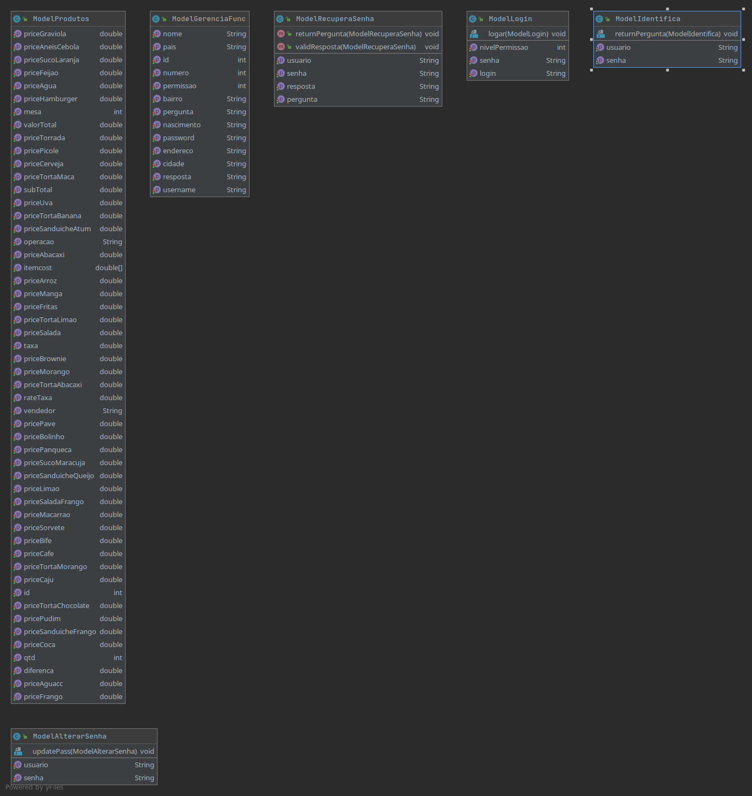
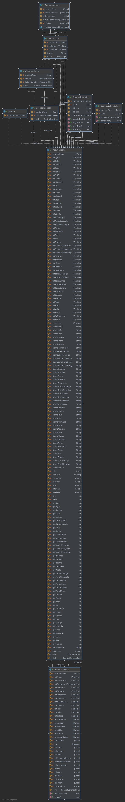
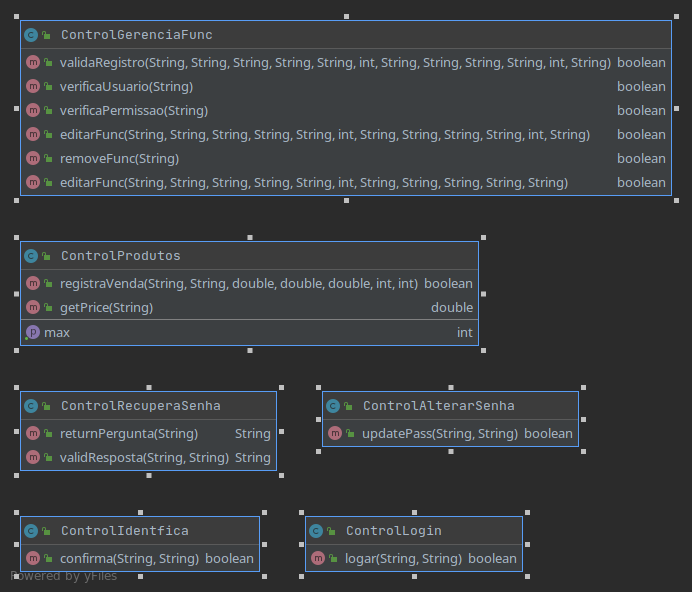
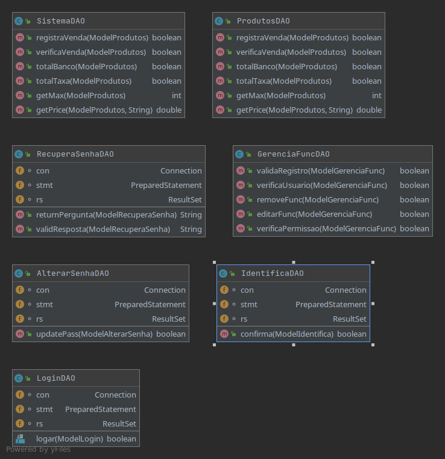
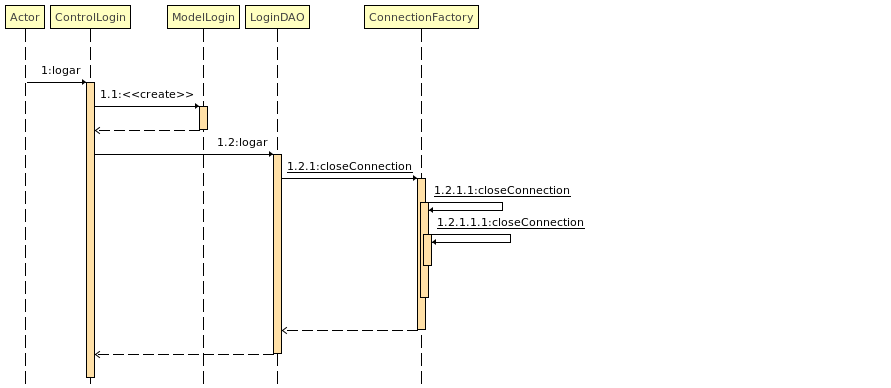
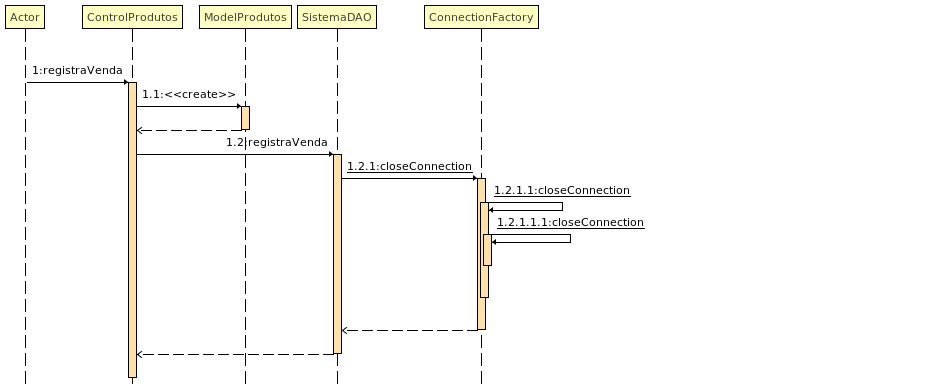
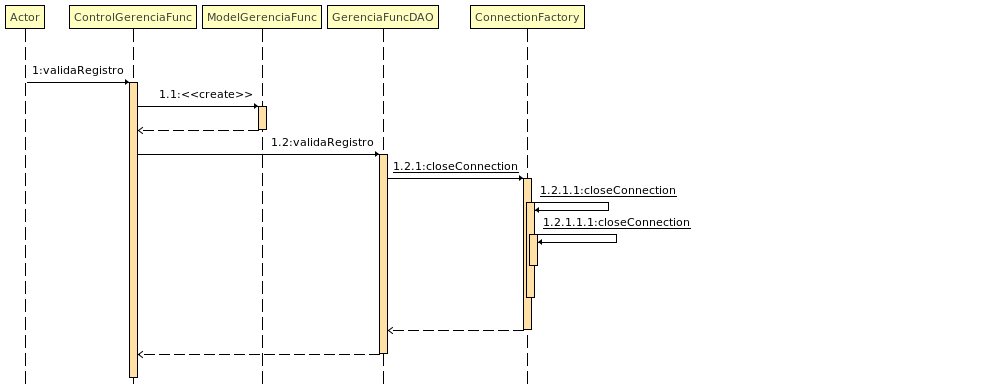

# Engenharia de Software
Repositório criado para a disciplina de Engenharia de Software.
Por alunos da Universidade Federal do Ceará - Campus Quixadá.

# Ambiente de desenvolvimento

- Linguagem de programação: Java
- Banco de dados: MariaDB
- Conector com banco de dados: MariaDB Connector/J 2.6.0 Stable
- IDE: Eclipse
- Plugins da IDE: WindowBuilder 1.9.3

# Sistema
O sistema trata-se de um sistema para um restaurante e tem as seguintes funcionalidades:

- Realiza um pedido (venda)
- Estorna pedido
- Usuário pode alterar sua senha
- Usuário pode tentar recuperar sua senha através do **Recuperar Senha**
- Gera um PDF de uma nota para impressão com informações do pedido.
- Gerente pode adicionar novos funcionários (torna-los capazes de acessar o sistema)
- Gerente pode remover funcionários do sistema
- Gerente pode ver os lucros baseados nas vendas registradas no banco de dados
- Gerente pode alterar o preço dos itens (produtos) do sistema
- Gerente pode alterar taxa utilizada no cálculo de cada venda
- Gerente pode adicionar tornar um usuário existente em um usuário com privilégios (gerente)

# Arquitetura do Software
Esse projeto utiliza arquitetura MVC. A arquitetura MVC funciona da seguinte maneira:

- Model: camada de manipulação dos dados
- View: camada de interação com o usuário do sistema.
- Controller: camada de controle (faz o meio campo entre view e model)

# Diagramas de Classe
- Model: 

- View: 

- Controller: 

- DAO: 

# Diagramas de Sequência
- ControlLogin:

- ControlRegistraVenda:

- ControlValidaCadastro: 

- ControlRemoveUser:

